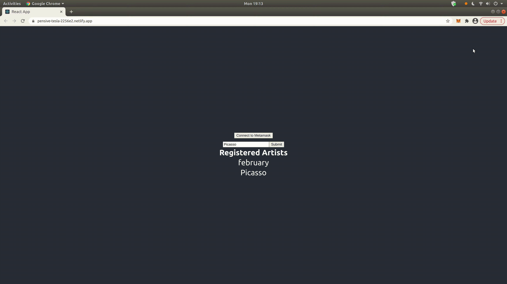
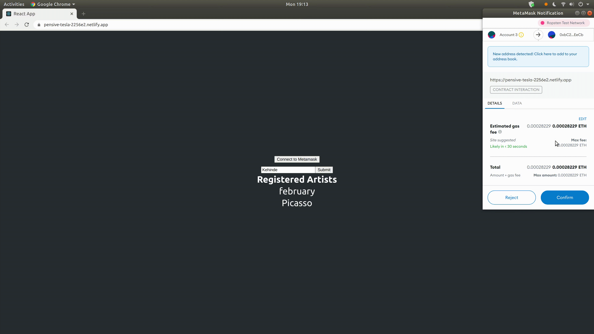

# Provenance

Decentralized provenance verification for physical art.

Artist register themselves to the contract. (TODO) Next they register their artwork on the ethereum block chain.  When they sell their art, ownership is transferred and they receive royalties . Buyers never have to wonder about the authenticity of the work.

Hosted at: https://pensive-tesla-2256e2.netlify.app




**Directory Structure**

Frontend is a React app located under the `/client` . Hardhat is the ethereum development environment and is located under `/tools`. 
```
project
|___client/
|   |____package.json
|   |____src/
|        |____artifacts/ //contract builds
|        |____App.js
|___tools/
|   |____contracts/
|   |____test/
|   |____hardhat.config.js
|   |____sample.env
|   |____package.json
```

**Workflow**
1. Connect to metamask.
2. Artist registers to contract. **NOTE: An address can only register once.**
3. UI displays registered artist.

TODO:
1. Artist mints nft for artwork with a url that links to metadata about the work. 
2. Artist sells artwork and transfers ownership.
3. No more questions of, "is this legit?"


## To Run
### Dependencies
- node.js
- MetaMask Chrome extension
- npm install ethers hardhat @nomiclabs/hardhat-waffle ethereum-waffle chai @nomiclabs/hardhat-ethers
- npm install in `/tools`
- yarn install in `/client`

### Running Locally
- Frontend: `yarn start` in `/client`
- Uncomment hardhat network in [hardhat.config.js](https://github.com/kiacolbert/blockchain-developer-bootcamp-final-project/blob/3ca68db75aef1dc3f0f6bda364400b73ebe9d066/tools/hardhat.config.js#L25-L27)
- Deploy contracts: `npx hardhat run scripts/deploy.js --network localhost`
- Update Provenance contract address in [App.js](https://github.com/kiacolbert/blockchain-developer-bootcamp-final-project/blob/3ca68db75aef1dc3f0f6bda364400b73ebe9d066/client/src/App.js#L6)
- Start local network: `npx hardhat node`
- Import test address into metamask

### Running on Test network
- Add desired network in `hardhat.config.js` under `module.exports`.
- Copy `sample.env` and rename to `.env`. Add private key to `ACCOUNTS`.

### Testing
In `tools/` run `npx hardhat test`


Public Ethereum Account: 0x3A4dCEC49e3085dA16c0B49411BfF8352908883e

